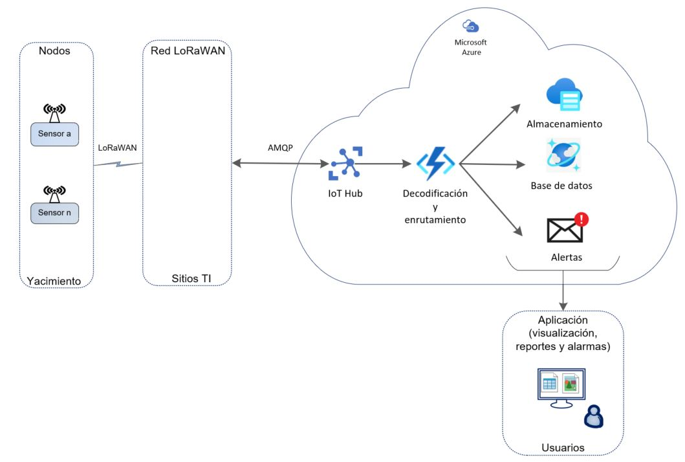

# Ejercicio CiberKillChain - Ataque

## Alumno

Eduardo Sciutto

## Enunciado

Armar una cyberkillchain usando técnicas de la matriz de Att&ck para un escenario relacionado a tu trabajo práctico

## Datos trabajo práctico

El trabajo práctico aborda el desarrollo de una solución de monitoreo de bajo costo para equipos de extracción de petróleo (AIB) de un yacimiento de periferia.

Se implementa un nodo comercial con protocolo de comunicación LoRaWAN, el cual dispone de entradas digitales y analógicas 4-20 mA. Se construirá y adaptará un transductor que sensará el estado funcional del AIB. Se utilizará una red LoRaWAN ya operativa en el yacimiento para otros servicios. El servidor de red LoRaWAN está instalado en un ambiente virtual on Premise (datacenter local de la compañia). Los demás componentes de aplicación se implementan en la nube de Microsoft Azure.

El servidor de red LoRaWAN canalizará la información generada por el sensor a un grupo de recursos creados en la nube de Microsoft Azure mediante el protocolo AMQP. En la nube de Azure se realizarán diferentes procesos, que contemplan la decodificación de la información, almacenamiento en base de datos, utilización de endpoints con una aplicación backend que administrará el acceso a información estadística y la notificación de alertas a los usuarios autorizados. 

Los usuarios dispondrán de una aplicación Web de frontend para el consumo de la información. La aplicación validará el login de cada usuario. Los usuarios sólo podrán visualizar datos históricos y el estado actual de cada dispositivo, pero no modificar parámetros.

En la figura 1 se presenta el diagrama en bloques del sistema descripto.

## Resolución

Se plantea un ataque al sistema descripto siguiendo el modelo de 7 fases de la Kill Chain de la Ciberceguridad, mediante técnicas que se describen en las matrices de ATT&CK https://attack.mitre.org/matrices/.

En particular se analizaron técnicas para entornos Cloud Azure AD, Enterprise, SaaS y IaaS.

El atacante podría actuar sobre el nodo (dispositivo sensor LoRaWAN instalado en el AIB), pero tendría en el mejor de los casos un impacto aislado, acotado a la afectación de dicho dispositivo. En cambio, si logra vulnerar la seguridad de la gestión del servidor de red LoRaWAN (NS) o los componentes desplegados en Azure, que soportan la aplicación web y la base de datos, el impacto será mucho más significativo.

### Reconnaissance

#### Nodo:
- El yacimiento donde se instalan los nodos, es muy vasto y sólo tiene controles de personas en los caminos de acceso principales. No hay videovigilancia en cada AIB. Un intruso no identificado podría acceder a la ubicación del nodo, hacer un relevamiento exhaustivo de su Hw e intentar conectarse por sus interfaces de configuración local (NFC o puerto USB). El software de gestion del nodo se descarga libremente de los Stores de Android e iOS. El firmware está protegido por una contraseña.

#### NS on Premise y Azure cloud 
- Aplicando técnicas de escaneo activo (por ejemplo wireshark, tcpdump) o aprovechando algún descuido de un empleado que gestione los servicios, el intruso detecta una forma de acceder  a información sencible. https://attack.mitre.org/techniques/T1595/ https://attack.mitre.org/techniques/T1078/ . 
También podría detectar fuentes con información guardada de manera insegura. (Bash history, repositorios, archivos con información de acceso a sistemas, etc.) https://attack.mitre.org/techniques/T1552/

### Weaponization

#### Nodo: 
- El atacante luego de investigar la documentación disponible en la pagina web del fabricante del nodo, recopila el usuario y contraseña por defecto del firmware, además planea y prepara una configuración del dispositivo adulterada.

#### NS on Premise y Azure cloud
- El atacante identifica una cuenta de algunos servicios de monitoreo y archivos no protegidos con información de usuarios y de URL del NS on premise. Requiere acceso desde la red interna de la empresa.
- El atacante identifica una lista de usuarios con permisos de acceso al la suscripción cloud (grupo de recursos de Azure donde se despliegan los componentes de la solución). No hace falta tener acceso a la red interna de la compañía, ya que no hay ninguna restricción de acceso al cloud desde internet.

### Delivery

#### Nodo: 
- En una nueva visita al sitio, el atacante prueba la contraseña por defecto con éxito y descarga la nueva configuración por NFC. Consulta los valores de lo sensores (sin mucho sentido ya que está en el lugar y ve el comportamiento del AIB).

#### NS on Premise y Azure cloud 
- Se despliega un ataque de ransomware mediante una macro incrustada en un email de pishing enviado a un grupo seleccionado de empleados que tienen cuenta de gesión en el NS y Azure.

### Explotación

#### NS on Premise y Azure cloud 
- El atacante captura información sensible que ingresa un usuario de forma desprevenida en respuesta al email malicioso. Luego hace un intento de replicar el proceso de autenticación, comprometiendo la confidencialidad de las credenciales o bypaseando algunos controles de acceso de sistemas utilizados en el cloud o en sistemas remotos (como ser VPNs y remote desktop)    https://attack.mitre.org/techniques/T1556/
- También eleva los privilegios del ambiente del dominio modificando la política vigente. (Por ejemplo en el IotHub con la política iothubowner) )https://attack.mitre.org/techniques/T1484/
- El atacante accede a los dashboards de servicios en el grupo de recursos de Azure para obtener información útil de un entorno operativo,  también ejecuta consultas adicionales y encuentra direcciones IP públicas y puertos abiertos para nuevos ataques. Esto permite que el adversario obtenga información sin realizar ninguna solicitud de API. https://attack.mitre.org/techniques/T1538/

### Instalation

#### NS on Premise y Azure cloud 
- Manipulación de cuenta. Sin afectar el acceso de la víctima, el atacante accede y modifica roles y permisos de la cuenta para habilitar el movimiento lateral o tener mayores privilegios para llegar a su objetivo. https://attack.mitre.org/techniques/T1098/
- El atacante escanea la red en busca de una vulnerabilidad para habilitar servicios remotos y control de escritorio remoto de servidores de la red.

### Command and Control

#### NS on Premise y Azure cloud
- Se usufructa la información recibida, como ser la base de datos https://attack.mitre.org/techniques/T1530/ . Permanentemente se inspecciona que la intrusión siga siendo no percibida, poniendo atención a las tareas de Auditoria de seguridad que tenga implementada la solución.

### Actions on Objectives

#### Nodo: 
- La nueva configuración desplegada en la visita al sitio, inutiliza al dispositivo. 
Otra acción puede ser modificar la frecuencia de reporting Interval a 1 vez por minuto, en vez de 1 vez por hora. Si esto se replicara a los “n” nodos de la red, afectará su performance.

#### NS on Premise y Azure cloud
- El intruso vende la información confidencial adquirida.
- El intruso realiza un ataque de endpoint o network Denial of Service (DoS) , para afectar la disponibilidad de los servicios a los usuarios. Por ejemplo saturando el ancho de banda con tráfico malicioso.  Por ejemplo usando un botnet y IP address spoofing para conducir el ataque (ZxShell, OnionDuke, Lucifer). https://attack.mitre.org/techniques/T1499/  https://attack.mitre.org/techniques/T1498/
- El intruso realiza un Account Access Removal  bloqueo/borrado de la cuenta (Por ejemplo LockerGoga) https://attack.mitre.org/techniques/T1531/
- El intruso realiza un borrado de datos. https://attack.mitre.org/techniques/T1485/ 
